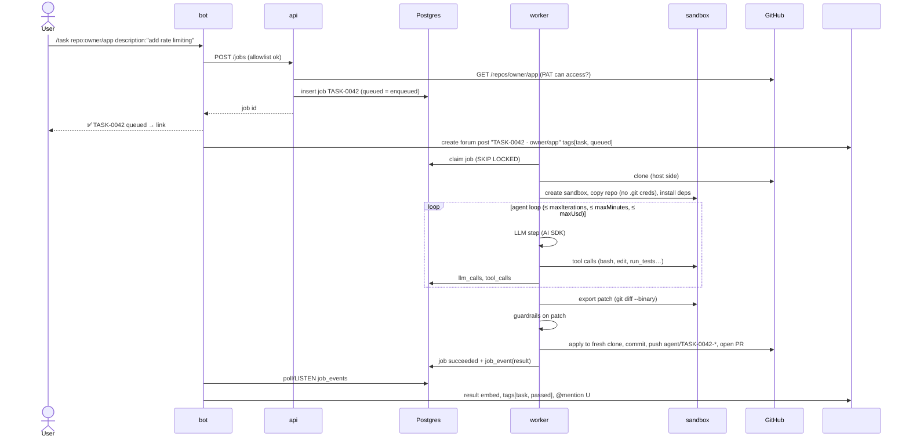
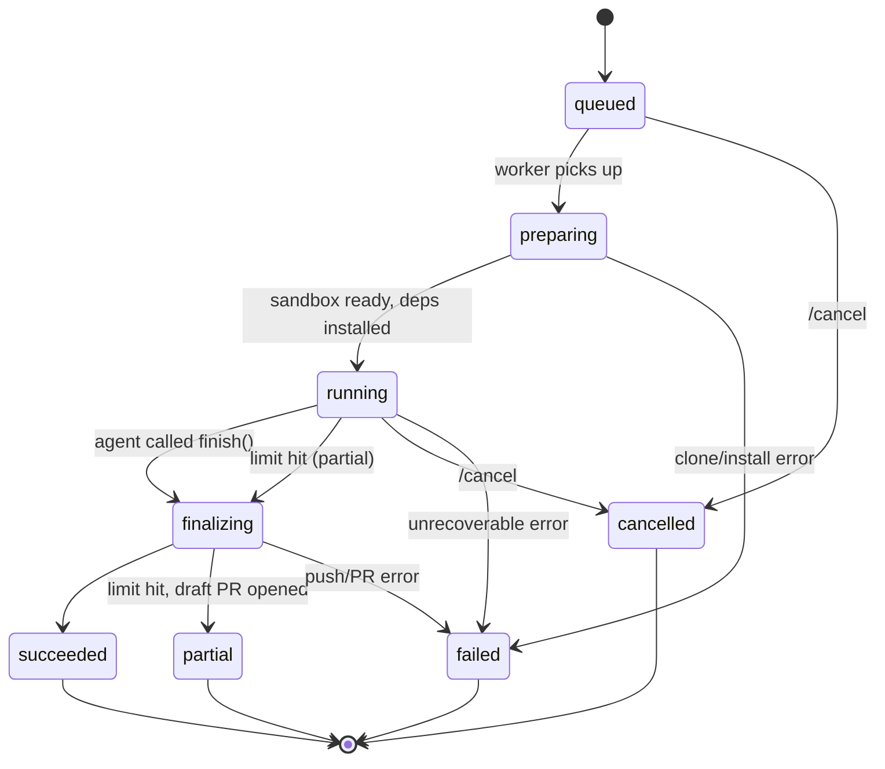

# Discord Coding Agent — Architecture v1

Status: **Draft v1** · Last updated: 2026-09-12

A self-hosted, autonomous coding agent driven from Discord. Users issue slash commands, the server queues a job, a worker runs an LLM agent loop against an isolated sandbox, and the result (PR, test report) is posted back to a Discord forum channel.

---

## 1. Goals and non-goals

### Goals (v1)
- Three core commands: `/task`, `/bugreport`, `/runtest`, plus `/status`, `/cancel`, `/jobs`.
- Fully autonomous: no human approval mid-run. Guardrails replace approvals.
- Every repo operation runs in a disposable sandbox with no credentials.
- Provider-agnostic LLM layer (Anthropic, OpenAI, OpenRouter) with per-profile model + fallback.
- Cost tracking per job and a hard monthly LLM spend cap.
- Web dashboard: jobs, logs, tool calls, cost charts, trigger/cancel.
- Runs locally on a Mac first; deploys unchanged to a single VPS (< $20/mo infra).

### Non-goals (v1)
- Mobile projects (native iOS deferred — needs macOS runners).
- Multi-tenant / multiple Discord servers.
- Per-command permissions (one allowlist for everything).
- Human-in-the-loop questions from the agent.
- External trace service (traces live in Postgres).

---

## 2. Decisions log

| # | Area | Decision |
|---|---|---|
| A1–A3 | Access | Single Discord server. Allowlist of user IDs + role IDs. Same permissions for all commands. |
| B4, J1 | GitHub auth | PAT belonging to a **separate bot GitHub account**, added as collaborator on target repos. |
| B5, B6 | Repo input | Exact `owner/repo`. Personal public + private repos. |
| C7 | `/task` | Opens a PR on a new branch. |
| C8 | `/bugreport` | Reproduce → fix → open PR automatically. |
| C9, C10 | `/runtest` | Runs the existing suite. Result → Discord embed + PR comment / commit status. |
| C11 | Inputs | Free text, screenshots, log files, issue/PR links. |
| D12, I1–I3 | Agent | TypeScript. Vercel AI SDK with our own loop. Providers: Anthropic, OpenAI, OpenRouter. Model + fallback set per profile. |
| D14 | Autonomy | Fully autonomous. |
| H1 | Limits | Per profile (see §6). |
| H2 | On limit/failure | Open **draft PR** with partial work + summary (if there is a diff). |
| H3 | PR state | Ready for review if tests pass, otherwise draft. |
| E16, H4–H5 | Stacks | Node/TypeScript, Python. Mobile skipped in v1. |
| E17 | Network | Sandbox egress limited to package registries. |
| E18 | Secrets | No real secrets in sandbox; env built from `.env.example`. |
| J3 | Repo config | Optional `.agent.yml`, auto-detect otherwise. |
| — | Queue | `jobs` table is the queue (`SELECT … FOR UPDATE SKIP LOCKED`); replaces pg-boss so enqueue is atomic with job creation. |
| J4 | Concurrency | Same repo may run multiple jobs, separate branches. Global worker concurrency = 2. |
| G1–G5 | Discord UX | `#create-job` (public ack with job ID) → `#responses` **forum** post per job with tags. Final result only. @mention on completion/failure. |
| J2 | Discord transport | Gateway websocket via discord.js (no public URL needed). |
| F20–F21 | Hosting | Local first; single VPS later. `SandboxProvider` abstraction. |
| K1–K2 | Dashboard | Discord OAuth login (same allowlist). Job list, logs, tool calls, cost charts, trigger/cancel. |
| K3 | Tracing | Stored in Postgres, rendered in our dashboard. |
| K4–K5 | Storage | Attachments on local disk volume. 30-day retention. |
| K6 | Spend | $10/month LLM cap; bot refuses new jobs when reached. |

---

## 3. System overview

```
 Discord
  #create-job ── /task /bugreport /runtest /status /cancel /jobs ─────┐
  #responses (forum) ◄───────────────────────────────┐              │
                                                     │              │
┌─────────────────────────── docker compose ─────────┼──────────────┼─────────────┐
│                                                    │              ▼             │
│ ┌────────────┐  HTTP  ┌────────────┐      ┌──────────────────────────────────┐  │
│ │ dashboard  │───────►│ api        │◄─────│ bot (discord.js gateway)         │  │
│ │ (Next.js)  │        │ (Fastify)  │      │  • command handlers → api        │  │
│ └────────────┘        └─────┬──────┘      │  • notifier: job_events → forum  │  │
│                             │             └──────────────────────────────────┘  │
│                             ▼                                                   │
│                  ┌──────────────────────┐                                        │
│                  │ Postgres             │ jobs (also the queue) · job_events ·    │
│                  │                      │ llm_calls · tool_calls · attachments    │
│                  └──────────┬───────────┘                                        │
│                             ▼                                                   │
│                  ┌──────────────────────┐   LLM API ──► Anthropic / OpenAI / OpenRouter
│                  │ worker (concurrency 2)│   GitHub API + git push (PAT) ──► GitHub
│                  │  prepare → agent loop │                                       │
│                  │  → finalize           │                                       │
│                  └──────────┬───────────┘                                        │
│                             │ exec / read / write  (no secrets cross this line)  │
│                  ┌──────────▼───────────┐     ┌─────────────────────────┐        │
│                  │ sandbox (1 per job)  │────►│ egress proxy            │──► npm, PyPI
│                  │ internal network only│     │ (allowlist, smokescreen)│        │
│                  └──────────────────────┘     └─────────────────────────┘        │
│   volumes: pgdata · attachments · workspaces                                     │
└──────────────────────────────────────────────────────────────────────────────────┘
```

### Components

| Component | Responsibility | Talks to |
|---|---|---|
| **bot** | Registers slash commands, checks allowlist, calls api, replies with job ID within 3s. Runs the **notifier** loop that turns `job_events` into forum posts, tag updates, and mentions. | Discord gateway + REST, api |
| **api** | Single write path for jobs. Validates repo access, stores attachments, enqueues, handles cancel. Serves dashboard data + Discord OAuth. Enforces monthly spend cap. | Postgres, GitHub API (repo validation) |
| **worker** | Claims `queued` jobs from the `jobs` table (`FOR UPDATE SKIP LOCKED`), heartbeats them, and reaps jobs of lost workers. Prepares workspace + sandbox, runs agent loop, finalizes (patch, guardrails, push, PR, status). Writes all events/costs. | Postgres, LLM providers, GitHub, SandboxProvider |
| **sandbox** | Ephemeral container per job. Repo checkout without `.git` credentials. Runs install/tests/agent commands. | egress proxy only |
| **egress proxy** | Allows only registry hosts (+ per-repo extras from `.agent.yml`). | Internet |
| **dashboard** | Read jobs/events/costs; trigger + cancel jobs through api. | api |
| **Postgres** | System of record; the `jobs` table doubles as the queue. | — |

Why the bot owns notifications (not the worker): workers stay Discord-agnostic, and Discord outages/rate limits never fail a job — events are retried from the table (outbox pattern).

---

## 4. Request lifecycle



### Job ID
`<PREFIX>-<n>` with per-type sequences: `TASK-0042`, `BUG-0017`, `TEST-0103`. Internal PK is a UUID; the short ID is unique and user-facing.

---

## 5. Job state machine



- Every transition inserts a `job_events` row; the notifier only reacts to terminal events (final-result-only UX) plus forum-post creation on `queued`.
- `/cancel` sets `cancel_requested_at`; the loop checks it between steps and the worker kills the sandbox.
- Worker crash: heartbeats stop → reaper marks the job `failed` with reason `worker_lost` (no automatic retry for jobs that may have pushed code).

---

## 6. Agent profiles

One agent runtime; behaviour comes from versioned profiles in `packages/profiles/`.

> **Implemented (M3):** profiles are typed TypeScript objects (limits, model, fallback) plus prompt constants, with per-command model overrides from env (`MODEL_<TYPE>`, `MODEL_<TYPE>_FALLBACK`) instead of YAML files. `/runtest` uses the loop only to explain failures, with read-only tools.

```yaml
# packages/profiles/task.yaml
id: task
version: 1
model:
  primary: anthropic:claude-sonnet-5
  fallback: openrouter:<model-id>
limits:
  maxIterations: 40
  maxMinutes: 20
  maxUsd: 2.00
tools: [bash, read_file, write_file, edit_file, list_files, grep, run_tests, view_attachment, finish]
systemPrompt: prompts/task.md
resultSchema: task        # zod schema in packages/profiles/schemas.ts
finalize:
  openPr: true
  prState: ready_if_tests_pass   # ready | draft | ready_if_tests_pass
  onLimit: draft_pr              # draft_pr | discard
  branchPrefix: agent/
```

| Profile | Model (primary) | Iter | Time | $ cap | Write tools | Finalize |
|---|---|---|---|---|---|---|
| `runtest` | `anthropic:claude-haiku-4-5` | 10 | 5 min | $0.30 | ❌ | Embed + PR comment/commit status (if ref is a PR) |
| `bugreport` | `anthropic:claude-sonnet-5` | 30 | 15 min | $1.50 | ✅ | Reproduce test + fix → PR (ready if tests pass) |
| `task` | `anthropic:claude-sonnet-5` | 40 | 20 min | $2.00 | ✅ | PR (ready if tests pass) |

Model IDs are config, not code — change them in YAML without redeploying the worker image.

### Tools

All tools execute through `SandboxProvider`; none have network or credential access beyond the sandbox.

| Tool | Purpose | Notes |
|---|---|---|
| `bash` | Run a shell command | Per-call timeout (default 120s), output truncated to head+tail 10 KB |
| `read_file` | Read file with line range | Size limit |
| `write_file` | Create/overwrite file | Not available to `runtest` |
| `edit_file` | Exact string replace | Not available to `runtest` |
| `list_files` | Glob listing | Respects `.gitignore` |
| `grep` | Ripgrep search | Result cap |
| `run_tests` | Run detected/configured test command with machine-readable reporter | Returns parsed summary + failures |
| `view_attachment` | Load user screenshot (image part) or log file | Images only for vision-capable models |
| `finish` | End the run with a profile-specific structured result | Validated with zod; invalid → error returned to model |

GitHub actions (push, PR, comment, status) are **not tools**. The worker performs them in `finalize`, after guardrails.

### Agent loop (`packages/agent`)

```
for step in 1..maxIterations:
  if cancelled or elapsed > maxMinutes or spent + estimateNext > maxUsd: break(partial)
  res = generateText({ model, system, messages, tools, maxSteps: 1 })   // AI SDK, one step
  record llm_call(tokens, cost, latency, provider)
  for call in res.toolCalls: record tool_call; result = sandbox.exec(call); append
  if call is finish(valid): break(done)
  on provider error (429/5xx after retries): switch to fallback model, continue
  context guard: if tokens > 70% window → compact old tool outputs to summaries
```

Cost = tokens × `packages/llm/pricing.ts` table (OpenRouter-reported cost used when present). Models without a known price and no reported cost are charged at a deliberately high placeholder rate so budgets still stop them.

---

## 7. Sandbox

### Interface

```ts
interface SandboxProvider {
  create(opts: { jobId: string; image: string; limits: ResourceLimits; network: EgressPolicy }): Promise<Sandbox>;
}
interface Sandbox {
  exec(cmd: string, opts?: { cwd?: string; timeoutMs?: number; env?: Record<string, string> }): Promise<ExecResult>;
  readFile(path: string): Promise<Buffer>;
  writeFile(path: string, data: Buffer | string): Promise<void>;
  copyIn(hostPath: string, sandboxPath: string): Promise<void>;
  exportPatch(): Promise<string>;   // git diff --binary against base commit
  destroy(): Promise<void>;
}
```

Implementations: `DockerSandboxProvider` (v1, local + VPS). Later: `E2BSandboxProvider`, `GitHubActionsProvider` (macOS / iOS).

### Images
- `sandbox-node`: Node 22 LTS, corepack (pnpm/yarn), ripgrep, git.
- `sandbox-python`: Python 3.12, uv, pip, poetry, ripgrep, git.

### Hardening

| Control | Local (Docker Desktop) | VPS |
|---|---|---|
| Runtime | runc | **gVisor (`runsc`)** |
| Volume setup | throwaway root container runs only `chown` on the new workspace volume | same |
| User | non-root uid 1000 | same |
| Capabilities | `--cap-drop=ALL`, `no-new-privileges` | same |
| Filesystem | read-only root, tmpfs `/tmp`, writable `/workspace` only | same |
| Resources | 2 CPU, 2 GB RAM, 256 pids, 5 GB disk | same |
| Network | internal Docker network; only route is egress proxy | same |
| Lifetime | destroyed at job end; reaper removes sandboxes older than 30 min | same |
| Secrets | none; env from `.env.example` | same |

### Egress allowlist
Squid proxy (`infra/proxy`) on an `internal: true` Docker network. Default allowlist: `.npmjs.org`, `.yarnpkg.com`, `pypi.org`, `files.pythonhosted.org` (`infra/proxy/allowlist.txt`). Per-repo `.agent.yml → network.extraHosts` is parsed but not applied in v1 (it would widen egress for every concurrent job). LLM and GitHub traffic originate from the **worker**, never the sandbox.

### Repo detection (when no `.agent.yml`)

| Signal | Image | Install | Test |
|---|---|---|---|
| `pnpm-lock.yaml` | node | `pnpm install --frozen-lockfile` | `package.json` `test` script + JUnit reporter if vitest/jest |
| `yarn.lock` / `package-lock.json` | node | `yarn install --frozen-lockfile` / `npm ci` | same |
| `uv.lock` / `pyproject.toml` / `requirements.txt` | python | `uv sync` / `pip install -r …` | `pytest --junitxml=.agent/junit.xml` |

### `.agent.yml` (optional, in target repo)

```yaml
image: node            # node | python
install: pnpm install --frozen-lockfile
test: pnpm vitest run --reporter=junit --outputFile=.agent/junit.xml
testReport: .agent/junit.xml
envFile: .env.example
network:
  extraHosts: [github.com]   # e.g. git-based dependencies
instructions: |
  Use Zod for validation. Never modify migrations in db/migrations.
```

---

## 8. GitHub integration

- **Identity:** dedicated bot GitHub account, invited as collaborator to each target repo. Blast radius = only invited repos.
- **Token:** PAT on the bot account. Try fine-grained first; if collaborator repos are not selectable for it, use a classic PAT with `repo` scope only — **no `workflow` scope**, so pushes that modify `.github/workflows/` are rejected by GitHub.
- **Token location:** worker + api env only. Never copied into sandbox, never in logs.

### Finalize (worker, host side)

1. Export `git diff --binary` inside the sandbox against a **baseline commit taken after dependency install**, so setup artefacts (e.g. a generated lockfile) are not part of the PR.
2. Guardrails on the patch:
   - reject changes under `.github/workflows/`, `.agent.yml`
   - secret scan on added lines (built-in patterns for private keys, GitHub/Anthropic/OpenAI/AWS/Slack/Google/Discord tokens)
   - no `.env` files, symlinks, submodules, `.git/` or `..` paths
   - size cap (files / lines changed)
   - empty diff → no PR, report "no changes"
3. Fresh clone on host → `git -c core.hooksPath=/dev/null apply` → commit as bot → push `agent/<JOB-ID>-<slug>`.
   *The agent-modified working tree is never used directly on the host — a malicious `.git/hooks` or `.git/config` filter written inside the sandbox cannot execute on the host.*
4. Run tests result (from last `run_tests` in sandbox) decides PR state: ready vs draft.
5. Open PR: title from result, body = summary, test results, job ID, cost, dashboard link. Label `agent`.
6. Never push to the default branch.

### `/runtest` on a PR
- Commit status `agent/runtest` (success/failure) on head SHA + PR comment with the same summary as the Discord embed (updated in place on re-run).

---

## 9. Discord UX

### Commands

| Command | Options |
|---|---|
| `/task` | `repo` (owner/repo, required) · `description` (required) · `base` (branch) · `attachment1..3` |
| `/bugreport` | `repo` · `description` · `steps` · `expected` · `issue` (URL/number) · `attachment1..3` |
| `/runtest` | `repo` · `ref` (branch or `#PR`) |
| `/status` | `job` (ID) |
| `/cancel` | `job` (ID) |
| `/jobs` | `limit` (default 10) · `status` filter |

Commands are only accepted in `#create-job` (except `/status`, `/jobs`). Non-allowlisted users get an ephemeral refusal.

### Acknowledgement (in `#create-job`, public)
```
✅ TASK-0042 queued · yashik/my-api · position 1
→ #responses › TASK-0042 · yashik/my-api
```

### `#responses` forum
- Post title: `TASK-0042 · yashik/my-api · add rate limiting`
- Tags — type: `task` `bugreport` `runtest`; status: `queued` `running` `passed` `failed` `partial` `cancelled`
- Post body on creation: request summary + original message link.
- On terminal state: one result message + tag update + `@requester`.

### Result embeds

**`/runtest`**
```
🟥 TEST-0103 · yashik/my-api @ feature/auth (a1b2c3d)
 Passed 42   Failed 2   Skipped 1   Duration 38s
 ─ Failing ─────────────────────────────────────
 ❌ auth/login.test.ts › rejects expired token
    Expected 401, received 500  (src/auth/verify.ts:57)
 ❌ auth/refresh.test.ts › rotates refresh token
    TypeError: cannot read 'id' of undefined
 ─ Likely cause ─────────────────────────────────
 verifyToken() throws on expired JWT instead of returning null.
 📎 junit.xml · full-log.txt
 haiku-4-5 · $0.04 · 1m12s · View job ↗
```
Colour: green (all pass) · red (failures) · grey (could not run). Max 10 failures listed; rest in attached file.

**`/task`, `/bugreport`**
```
🟩 TASK-0042 · PR #18 ready for review
 Add token-bucket rate limiting to /api routes
 • Files changed 5 (+142 −9)
 • Tests 44 passed, 0 failed
 • Summary: middleware in src/middleware/rateLimit.ts, config via RATE_LIMIT_*
 sonnet-5 · $0.84 · 14 iterations · 6m · View job ↗
```
Partial: `🟨 … draft PR #19 — stopped at iteration limit`, with "what's done / what's left".

---

## 10. Data model (Drizzle, Postgres)

```
jobs
  id uuid pk · short_id text unique · type enum(task,bugreport,runtest)
  status enum · repo text · ref text · input jsonb (description, steps, links)
  requested_by_discord_id text · source enum(discord,dashboard)
  profile_id text · profile_version int · model_primary text · model_used text
  discord_forum_thread_id text · discord_ack_message_id text
  result jsonb · pr_url text · error text
  iterations int · cost_usd numeric(10,4) · started_at · finished_at
  cancel_requested_at · created_at

job_events      id · job_id fk · type text · payload jsonb · created_at · notified_at
llm_calls       id · job_id fk · step int · provider · model · input_tokens · output_tokens
                · cached_tokens · cost_usd · latency_ms · request jsonb · response jsonb · created_at
tool_calls      id · job_id fk · llm_call_id fk · name · args jsonb · output text (truncated)
                · exit_code · duration_ms · created_at
attachments     id · job_id fk · kind(image,log,other) · filename · mime · size · path · created_at
job_counters    type pk · last_value int
dashboard_sessions  id · discord_user_id · expires_at
```
`jobs` also carries `worker_id` and `heartbeat_at` for queue claims and lost-worker detection.

**Spend cap:** api rejects a new job if `sum(llm_calls.cost_usd this month) + profile.maxUsd > MONTHLY_LLM_CAP_USD`. Worker re-checks before each LLM call.

**Retention:** a nightly worker task deletes jobs (cascade) and attachment files older than 30 days.

---

## 11. Dashboard

Next.js app, Discord OAuth2 login (scope `identify`, `guilds.members.read` for role check) → session cookie; same allowlist as bot.

| Page | Content |
|---|---|
| Jobs | Filterable table: ID, type, repo, status, cost, duration, requester. Live refresh. |
| Job detail | Input, timeline of events, step-by-step LLM calls + tool calls (collapsible), diff, PR link, result, **Cancel**. |
| New job | Form mirroring the slash commands; posts to api (forum post still created). |
| Costs | Spend this month vs cap; charts by day / command / model; top expensive jobs. |

---

## 12. Repository layout

```
discord-coding-assistant/
├─ apps/
│  ├─ bot/          discord.js gateway, commands, notifier
│  ├─ api/          Fastify: jobs, attachments, auth, dashboard API
│  ├─ worker/       job claimer: prepare → agent → finalize
│  └─ dashboard/    Next.js
├─ packages/
│  ├─ core/         job types, state machine, config (zod-validated env)
│  ├─ db/           Drizzle schema, migrations, queries
│  ├─ llm/          AI SDK provider registry, fallback, pricing
│  ├─ agent/        loop, tools, context compaction
│  ├─ sandbox/      SandboxProvider + DockerSandboxProvider, repo detection
│  ├─ github/       PAT client, clone, patch apply, PR/status/comment
│  ├─ profiles/     task/bugreport/runtest YAML, prompts/, schemas.ts
│  └─ discord-ui/   embed builders (shared by bot + tests)
├─ infra/
│  ├─ compose.yml           base
│  ├─ compose.vps.yml       gVisor runtime, Caddy, restart policies
│  ├─ images/sandbox-node/  Dockerfile
│  ├─ images/sandbox-python/
│  ├─ proxy/                smokescreen allowlist
│  └─ caddy/Caddyfile
├─ docs/ARCHITECTURE.md
└─ .env.example
```

Tooling: pnpm workspaces, TypeScript strict, Vitest, Biome (lint/format), pino (structured logs).

### Environment

```
DISCORD_TOKEN, DISCORD_APP_ID, DISCORD_GUILD_ID
DISCORD_CREATE_JOB_CHANNEL_ID, DISCORD_RESPONSES_FORUM_ID
ALLOWED_USER_IDS, ALLOWED_ROLE_IDS
DISCORD_OAUTH_CLIENT_SECRET, DASHBOARD_URL, SESSION_SECRET
GITHUB_BOT_TOKEN, GITHUB_BOT_LOGIN
ANTHROPIC_API_KEY, OPENAI_API_KEY, OPENROUTER_API_KEY
DATABASE_URL
WORKER_CONCURRENCY=2
MONTHLY_LLM_CAP_USD=10
SANDBOX_PROVIDER=docker   SANDBOX_RUNTIME=runc|runsc
ATTACHMENTS_DIR=/data/attachments   RETENTION_DAYS=30
```

---

## 13. Deployment

### Local (Mac)
- Docker Desktop, `docker compose up`.
- Bot uses gateway → no tunnel needed. Dashboard at `http://localhost:3000`, OAuth redirect to localhost.
- `SANDBOX_RUNTIME=runc`.

### VPS (24/7)
- One small VPS: 4 vCPU / 8 GB RAM / 80 GB disk (e.g. Hetzner shared-vCPU tier, well under $20/mo). Fits Postgres + 4 services + 2 sandboxes.
- Ubuntu LTS, Docker Engine, gVisor `runsc` registered as Docker runtime.
- `docker compose -f compose.yml -f compose.vps.yml up -d` with `restart: unless-stopped` and healthchecks.
- Caddy terminates HTTPS for the dashboard on a domain (needed for Discord OAuth redirect). Only ports 22/80/443 open (ufw). SSH key-only.
- Backups: nightly `pg_dump` compressed, kept 7 days on disk + copied off-box (e.g. provider snapshot or object storage).
- Uptime: worker and bot write heartbeats; external free ping monitor on dashboard `/healthz`.
- Deploy: GitHub Actions builds images → GHCR → SSH `compose pull && up -d` (later).

---

## 14. Security model summary

| Threat | Mitigation |
|---|---|
| Untrusted repo code / prompt injection in issues, READMEs | No secrets in sandbox; egress allowlist; gVisor; tools cannot reach GitHub; finalize guardrails |
| Agent exfiltrates PAT | PAT never enters sandbox or LLM context; redaction filter on logs |
| Malicious `.git` hooks/filters executing on host | Patch exported and applied to fresh host clone with hooks disabled |
| Agent edits CI to run code with repo secrets | Workflow file changes rejected; token lacks `workflow` scope |
| Runaway cost | Per-job caps, monthly cap, cheap model for runtest |
| Unauthorized Discord user | Allowlist check in bot + api; dashboard same allowlist |
| Default branch damage | Agent branches only; recommend branch protection on `main` |

---

## 15. Build milestones

| M | Scope | Done when |
|---|---|---|
| **M0** | Monorepo scaffold, config, Drizzle schema, compose (Postgres) | `pnpm test` + migrations run |
| **M1** | bot + api + Postgres queue; all 6 commands create/read/cancel jobs; forum post + tags; stub worker that completes jobs | Full Discord round-trip with fake results |
| **M2** | DockerSandboxProvider, images, egress proxy, repo detection, `.agent.yml` | `/runtest` runs a real suite and posts a deterministic embed (no LLM) |
| **M3** | LLM package (3 providers, fallback, pricing), agent loop, tools, budgets, `llm_calls`/`tool_calls` recording, spend cap | `/runtest` with "likely cause" analysis within $0.30 |
| **M4** | GitHub finalize: patch export, guardrails, push, PR, draft-on-partial, commit status + PR comment | `/bugreport` and `/task` open PRs on a test repo |
| **M5** | Dashboard: OAuth, jobs, job detail, costs, trigger/cancel | Usable from browser |
| **M6** | VPS: gVisor, Caddy, backups, retention cron, heartbeats | Runs 24/7 on VPS |

---

## 16. Open risks / to verify

1. **$10/month cap vs $2 task cap** — worst case ~5 full `/task` runs a month. Expect to raise the cap or use cheaper models once real costs are measured.
2. **Fine-grained PAT on collaborator repos** — verify during M4 setup; fallback is classic PAT (`repo` only) on the bot account.
3. **Provider fallback mid-conversation** — switching models between steps with tool history must be tested per provider pair.
4. **Test suites needing real services** (DBs, external APIs) will fail with `.env.example` fakes. v1 reports "could not run"; later add `services:` in `.agent.yml` (sidecar Postgres/Redis).
5. **Discord attachment URLs expire** — download to local volume at job creation.
6. **iOS support** — future `GitHubActionsProvider` with macOS runners.
